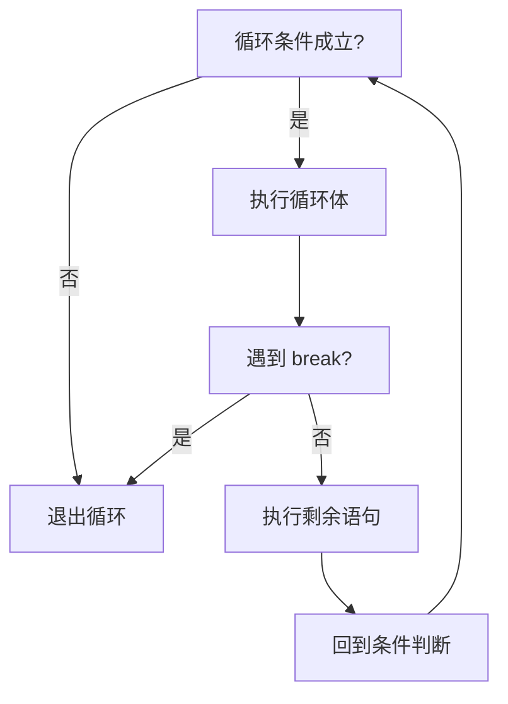
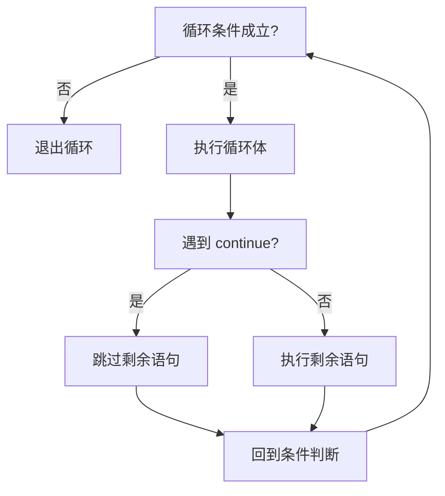

# 第05章 循环结构：for / while / do-while

> 💡 一句话概括：循环让程序"重复执行"——`for` 管已知次数，`while` 管未知次数，`do-while` 管至少一次，`break`/`continue` 管中途控制。

> 💡 提示
    循环是编程中最重要的控制结构之一，几乎所有算法都离不开它。本章你将学习：

    - `for` / `while` / `do-while` 三种循环的语法与适用场景
    - `break` 和 `continue` 控制循环流程
    - 循环嵌套与经典图形打印
    - 循环边界条件、作用域与常见越界陷阱

---

## 📌 学习目标

> ❓ **想一想**：你有没有想过，为什么C++提供了三种不同的循环（for、while、do-while），而不是一种就够了？

读完本章后，你应当能够：

1. **准确区分** `for`、`while`、`do-while` 三种循环的执行流程，能针对"已知次数 / 未知次数 / 至少一次"的场景选择正确的循环结构。
2. **独立编写** 累加、累乘、求数字位数、打印图形等 10 行以内的循环程序，无死循环、无越界。
3. **说清** `break` 与 `continue` 的区别，能用流程图画出两者的执行路径。
4. **写出** 九九乘法表等双重循环嵌套程序，并估算嵌套循环的执行次数（N×M）。
5. **识别** `for (int i = 0; i <= n; i++)` 这类边界错误导致的数组越界问题。

---

## 💡 生活类比

> ❓ **想一想**：你有没有想过，编程中的循环和你每天重复做的事情（比如每天刷牙、每天上学）有什么相似之处？

> 循环就像体育老师让你"绕操场跑 10 圈"——老师不会说"跑第 1 圈、跑第 2 圈……跑第 10 圈"，而是说"跑 10 圈"。循环就是让程序**重复执行某段代码**的工具。

三种循环对应三种"跑步"方式：

- **`for`**：老师明确说"跑 10 圈"——**次数已知**，跑完就停。
- **`while`**：老师说"跑到下课铃响为止"——**先听铃声再跑**，铃没响就一直跑，可能一圈都没跑就下课了。
- **`do-while`**：老师说"先跑一圈看看，累了再停"——**先跑一圈再决定**，至少跑一圈。

---

## 核心概念

> ❓ **想一想**：你有没有想过，for、while、do-while 这三种循环到底什么时候该用哪个？如果选错了会怎样？

### for 循环：已知次数的重复

> 💡 一句话概括：`for` 循环把"初始化、条件、更新"三件事写在一行，适合已知次数的重复。

「`for` 循环 for loop」适合**已知重复次数**的场景：

```cpp
for (初始化; 条件; 更新) {
    // 要重复执行的代码
}
```

三部分的执行时机：

| 部分 | 作用 | 执行时机 |
|------|------|---------|
| **初始化** | 设定循环变量的起点 | 循环开始前执行**一次** |
| **条件** | 判断是否继续循环 | **每轮开始前**判断，为真才执行循环体 |
| **更新** | 改变循环变量 | **每轮结束后**执行 |

📖 通俗解释：`for (int i = 1; i <= 5; i++)` 就像"从 1 数到 5"——一开始 i=1，每数完一个数 i 就加 1，数到 i>5 时停止。

### while 循环：先判断后执行

> 💡 一句话概括：`while` 先看条件再决定做不做，适合"不知道要做多少次"的场景。

「`while` 循环 while loop」适合**不知道要循环多少次**的场景，只要条件为真就一直循环：

```cpp
while (条件) {
    // 条件为真时重复执行
}
```

> 💡 生活类比：`while` 就像吃饭：**只要**碗里还有饭（条件成立），就继续吃。你不知道要吃几口，但只要"碗里有饭"这个条件成立，就一直吃下去。

### do-while 循环：先执行后判断

> 💡 一句话概括：`do-while` 先做再说，做完再判断要不要继续，保证至少执行一次。

「`do-while` 循环 do-while loop」会**先执行一次循环体，再判断条件**。即使条件一开始就为假，也会至少执行一次：

```cpp
do {
    // 循环体
} while (条件);          // 注意末尾有分号！
```

### 三种循环适用场景对比

下表对比了三种循环的核心差异，帮你快速做出选择：

| 特性 | for | while | do-while |
|------|-----|-------|----------|
| **判断时机** | 先判断后执行 | 先判断后执行 | **先执行后判断** |
| **最少执行次数** | 0 次 | 0 次 | **1 次** |
| **适用场景** | 已知次数（遍历、累加） | 未知次数（读数据、求数字位数） | 至少执行一次（输入校验、菜单） |
| **典型用法** | `for (int i=1; i<=n; i++)` | `while (n > 0)` | `do { cin>>x; } while(x<=0);` |

结论：知道次数用 `for`，不知道次数用 `while`，必须至少一次用 `do-while`。

> 💡 提示
    问自己两个问题：**①知道循环多少次吗？②至少要执行一次吗？** 知道次数用 `for`；不知道次数但可能 0 次用 `while`；必须至少一次用 `do-while`。

### 循环变量的作用域

> ⚠️ 警告
    写成 `for (int i = ...)` 时，变量 `i` **只在循环内有效**，循环结束后 `i` 就"消失"了，不能再使用：

    ```cpp
    for (int i = 1; i <= 5; i++) {
        cout << i;
    }
    cout << i;        // 编译错误！i 已经"过期"

    // 如果需要在循环外使用 i，要在循环外声明：
    int i;
    for (i = 1; i <= 5; i++) { ... }
    cout << i;        // 此时 i = 6，可以使用
    ```

### 循环边界条件：i < n vs i <= n

边界条件是循环最容易出错的地方。**`i < n` 和 `i <= n` 只差一个等号，行为却完全不同**：

```cpp
// 写法1：i <= n，循环 n 次（i 取 1,2,...,n）
for (int i = 1; i <= n; i++) { ... }      // 共 n 次

// 写法2：i < n，循环 n 次（i 取 0,1,...,n-1）
for (int i = 0; i < n; i++) { ... }       // 共 n 次
```

> 💡 提示
    - **遍历数组**时习惯用 `for (int i = 0; i < n; i++)`（下标从 0 开始，到 n-1 结束）。
    - **数数**时习惯用 `for (int i = 1; i <= n; i++)`（从 1 数到 n）。

    两者都能循环 n 次，关键看下标从 0 还是从 1 开始，**千万别混用**。

---

## 代码实现

> ❓ **想一想**：你有没有想过，学完循环语法后，真正能用循环解决哪些实际问题？

### for 循环示例：累加求和

```cpp
#include <bits/stdc++.h>
using namespace std;

int main() {
    int n;
    cin >> n;
    long long sum = 0;                  // 累加器先初始化为 0
    for (int i = 1; i <= n; i++) {
        sum += i;                       // 等价于 sum = sum + i
    }
    cout << "1到" << n << "的和是：" << sum;
    return 0;
}
// 输入 100：输出 1到100的和是：5050
```

> 💡 生活类比：累加就像往存钱罐里塞钱：一开始存钱罐是空的（`sum = 0`），每天塞 1 元、2 元、3 元……最后打开一看，就是总和。

### while 循环示例：求数字位数

```cpp
#include <bits/stdc++.h>
using namespace std;

int main() {
    int n;
    cin >> n;
    int count = 0, temp = n;
    while (temp > 0) {
        temp /= 10;                    // 每次去掉一位
        count++;
    }
    cout << n << " 有 " << count << " 位";
    return 0;
}
// 输入 12345：输出 12345 有 5 位
```

**变量 temp 的值变化追踪：**

| 轮次 | temp 的值 | count |
|------|----------|-------|
| 初始 | 12345 | 0 |
| 第1轮 | 1234 | 1 |
| 第2轮 | 123 | 2 |
| 第3轮 | 12 | 3 |
| 第4轮 | 1 | 4 |
| 第5轮 | 0 | 5 |
| 结束 | 0（不满足条件） | 5 |

### do-while 循环示例：输入校验

```cpp
#include <bits/stdc++.h>
using namespace std;

int main() {
    int n;
    do {
        cout << "请输入一个正数：";
        cin >> n;
    } while (n <= 0);                  // 输入非正数就重来
    cout << "你输入了：" << n;
    return 0;
}
// 输入 -5 → 提示重新输入 → 输入 0 → 提示重新输入 → 输入 10 → 输出"你输入了：10"
```

> ⚠️ 警告
    `do-while` 末尾的 `while(条件)` 后面**必须加分号**，忘了会编译报错。

### break 示例：找到就停

> 💡 一句话概括：`break` 是"不干了"——一旦遇到，立即跳出整个循环。

「`break` 语句」的作用是**立即跳出当前循环**，不再执行后面的循环体：

```cpp
#include <bits/stdc++.h>
using namespace std;

int main() {
    // 找到第一个大于 100 的 7 的倍数
    for (int i = 7; ; i += 7) {         // 条件留空，相当于死循环
        if (i > 100) {
            cout << "找到了：" << i;    // 输出 105
            break;                      // 找到就跳出
        }
    }
    return 0;
}
// 输出：找到了：105
```

> 💡 生活类比：`break` 就像找东西：你翻箱倒柜找钥匙，**一旦找到就立刻停止**，不会再继续翻其他柜子。

### continue 示例：跳过本轮

> 💡 一句话概括：`continue` 是"跳过这题"——跳过本轮剩余代码，直接进入下一轮。

「`continue` 语句」的作用是**跳过本轮剩余代码，直接进入下一轮循环**：

```cpp
#include <bits/stdc++.h>
using namespace std;

int main() {
    // 打印 1~10 中所有的奇数
    for (int i = 1; i <= 10; i++) {
        if (i % 2 == 0) {
            continue;                   // 偶数就跳过，不执行下面的 cout
        }
        cout << i << " ";               // 只打印奇数
    }
    return 0;
}
// 输出：1 3 5 7 9
```

### break vs continue 流程对比

**break 执行流程：**



**continue 执行流程：**



> 💡 提示
    - `break`：**彻底退出循环**（不干了）——像写作业笔坏了，不写了。
    - `continue`：**跳过这一轮**，继续下一轮——像遇到难题先跳过，继续做下一题。

---

## ⚠️ 常见误区

> ❓ **想一想**：你有没有想过，为什么循环看起来简单，但实际写代码时却总是出错？

### 误区1：for(int i=0; i<=n; i++) 导致数组越界

这是新手最致命的错误之一。**遍历数组时用 `i <= n` 而不是 `i < n`，会多访问一个元素，导致越界**：

| 写法 | 后果 |
|------|------|
| ❌ `for (int i = 0; i <= 100; i++)` | i 会取到 100，`a[100]` 越界！ |
| ✅ `for (int i = 0; i < n; i++)` | i 取 0~n-1，安全 |

```cpp
int a[100];                          // 有效下标是 0~99
for (int i = 0; i <= 100; i++) {     // ❌ i 会取到 100，a[100] 越界！
    a[i] = i;
}
```

> ⚠️ 警告
    数组越界不会编译报错，但会**访问非法内存**：轻则读到垃圾数据导致结果错误，重则程序崩溃（Segmentation Fault）。在 CSP-J 评测中，越界常常导致"本地能过、提交 RE（运行时错误）"的诡异现象。

> 💡 提示
    **"数组从 0 开始，到 n-1 结束，循环用 `<` 不用 `<=`"**。

### 误区2：累加器忘初始化或累乘器初始化为 0

| 写法 | 后果 |
|------|------|
| ❌ `long long sum;` 未初始化 | 初始值是随机垃圾值，结果不可预测 |
| ❌ `long long fact = 0;` 累乘器初始化为 0 | 0 乘任何数都是 0，结果永远是 0 |
| ✅ `long long sum = 0;` | 累加器正确初始化为 0 |
| ✅ `long long fact = 1;` | 累乘器正确初始化为 1 |

> ⚠️ 警告
    阶乘增长极快，`20!` 就超过 `long long` 范围了，输入 `n` 较大时要注意溢出。

### 误区3：忘记更新循环变量导致死循环

| 写法 | 后果 |
|------|------|
| ❌ `while (i <= 10) { cout << i; }` 忘了 `i++` | i 永远是 1，条件永远成立，死循环 |
| ✅ `while (i <= 10) { cout << i; i++; }` | 正常循环 |

> ⚠️ 警告
    死循环会让程序卡住无法结束。在 Dev-C++ 里遇到死循环，按 **Ctrl+C** 或关闭运行窗口强制终止。**每次写循环时检查：循环变量有没有被更新？条件最终会不会变假？**

### 误区4：嵌套循环中 break 只跳一层

| 场景 | 后果 |
|------|------|
| ❌ 以为 `break` 能跳出所有循环 | 只跳出最内层，外层继续 |
| ✅ 理解 `break` 只跳一层 | 需要跳出多层时用标志变量 |

```cpp
for (int i = 1; i <= 3; i++) {
    for (int j = 1; j <= 3; j++) {
        if (j == 2) break;            // 只跳出内层 j 循环
        cout << i << "," << j << " ";
    }
    // break 后会到这里，外层 i 循环继续
}
// 输出：1,1 2,1 3,1
```

### 误区5：浮点数做循环条件

| 写法 | 后果 |
|------|------|
| ❌ `for (double x = 0; x != 1.0; x += 0.1)` | 浮点精度问题，可能永远不精确等于 1.0 → 死循环 |
| ✅ `for (double x = 0; x < 1.0; x += 0.1)` | 用 `<` 或 `<=`，安全 |

---

## 典型例题：九九乘法表

> ❓ **想一想**：你有没有想过，九九乘法表为什么能用两层循环嵌套完美打印出来？外层的行和内层的列之间有什么规律？

**题目**：打印九九乘法表，格式如下：

```
1*1=1
1*2=2  2*2=4
1*3=3  2*3=6  3*3=9
...（共 9 行）
```

**分析**：这是循环嵌套的经典应用。外层循环控制行（被乘数 `i`），内层循环控制列（乘数 `j`）。第 `i` 行有 `i` 个式子，所以内层循环 `j` 从 1 到 `i`。

```cpp
#include <bits/stdc++.h>
using namespace std;

int main() {
    for (int i = 1; i <= 9; i++) {           // 外层：行（被乘数）
        for (int j = 1; j <= i; j++) {       // 内层：列（乘数）
            printf("%d*%d=%-2d ", j, i, i * j);
        }
        printf("\n");
    }
    return 0;
}
// 输出：
// 1*1=1
// 1*2=2  2*2=4
// 1*3=3  2*3=6  3*3=9
// ...
```

> 💡 提示
    `%d` 输出整数，`-2` 表示**左对齐，占 2 个字符宽度**，让每列对齐美观。

**关键点**：内层循环的次数 `j <= i` 随着 `i` 变化，所以每行式子数递增——这正是嵌套循环"内层依赖外层变量"的典型模式。打印直角三角形也是同样思路：

```cpp
for (int i = 1; i <= n; i++) {           // 第 i 行
    for (int j = 1; j <= i; j++) {       // 第 i 行打印 i 个星号
        cout << "*";
    }
    cout << endl;
}
// n=3 时输出：
// *
// **
// ***
```

---

## 📚 本节练习

> ❓ **想一想**：你有没有想过，光看不练能不能真正掌握循环？

### 🟢 基础题（CSP-J 难度，巩固基础）

**练习 1**：[P5718] 找最小值 - https://www.luogu.com.cn/problem/P5718
> 输入 n 个正整数，找出其中的最小值。
**提示**：先读入 n，再用 `for` 循环读 n 个数。设 `minv` 为第一个数（或一个很大的值），每次读入一个数就和 `minv` 比较，比它小就更新。复习 `for` 循环与累加思想（这里是"累比"）。

**练习 2**：[P5721] 数字直角三角形 - https://www.luogu.com.cn/problem/P5721
> 输入 n，打印数字直角三角形。例如 n=3 时输出：`1` / `2 3` / `4 5 6`。
**提示**：双重循环嵌套。外层控制行 `i`，内层控制列 `j`。用一个全局递增的计数器 `cnt`，每打印一个就 `cnt++`。复习"循环嵌套"——内层次数依赖外层变量。

### 🟡 拓展题（CSP-S 入门，需思考）

**练习 3**：[P1980] 计数问题 - https://www.luogu.com.cn/problem/P1980
> 输入 n 和 x，统计 1~n 中所有整数里数字 x 出现的次数。
**提示**：外层 `for (int i = 1; i <= n; i++)` 遍历每个数，内层用 `while` 把当前数的每一位拆出来（`% 10` 取个位，`/ 10` 去掉一位），遇到 x 就计数。这是 `for` + `while` 混合的经典题，复习"求数字位数"。

**练习 4**：[P1307] 数字反转 - https://www.luogu.com.cn/problem/P1307
> 输入一个整数 N，将其反转后输出。例如 `123` → `321`，`-380` → `-83`。
**提示**：用 `while` 循环，每次 `result = result * 10 + n % 10`，然后 `n /= 10`。注意处理负数（先取绝对值再反转）和前导零。复习 `while` 适合"未知循环次数"的场景。

### 🔴 CSP-S 真题变式（进阶）

**练习 5**：[P1089] 津津的储蓄计划 - https://www.luogu.com.cn/problem/P1089
> 津津每月有 300 元零花钱，每个月初规划花销。钱够就花，不够就把整百存进妈妈那里（年利率 20%）。年底计算她共有多少钱。
**提示**：用 `for` 循环读入 12 个月花销，每月维护"手里剩余的钱"。如果某月不够花，输出负数月份并用 `break` 提前结束。复习 `break` 的提前退出用法。

**练习 6**：[P1424] 小鱼的航程（改进版）- https://www.luogu.com.cn/problem/P1424
> 小鱼从某周几开始游泳，每天游 250 米，周六周日休息。给定起始星期和游泳天数 n，求总距离。
**提示**：用 `for` 循环遍历 n 天，用 `(起始星期 + 已经过天数 - 1) % 7` 判断今天是周几，周末用 `continue` 跳过。复习 `continue` 跳过本轮的用法。

---

## 📖 本章总结

> ❓ **想一想**：你有没有想过，学完循环后，你掌握了哪些核心技能？还有哪些地方容易踩坑？

### 核心要点回顾

- ✅ `for` 适合**已知次数**，`while` 适合**未知次数**，`do-while` 适合**至少一次**
- ✅ 累加器初始化为 **0**，累乘器初始化为 **1**
- ✅ `break` 彻底跳出循环，`continue` 跳过本轮进入下一轮
- ✅ 嵌套循环中 `break` 只跳一层，执行次数是 **N × M**，要警惕 TLE
- ✅ 数组遍历用 `i < n`（从 0 到 n-1），**千万别用 `i <= n`** 否则越界
- ✅ 循环变量 `for (int i=...)` 的 `i` 只在循环内有效
- ✅ 写循环必查：循环变量有没有更新？条件最终会不会变假？

### 常见陷阱

- ❌ `for (int i=0; i<=n; i++)` 数组越界 → ✅ 数组遍历用 `i < n`
- ❌ 累加器未初始化或累乘器初始化为 0 → ✅ 累加器=0，累乘器=1
- ❌ `while` 忘记更新循环变量 → 死循环 → ✅ 检查条件最终是否会变假
- ❌ 嵌套循环中 `break` 以为跳出所有循环 → ✅ `break` 只跳一层
- ❌ 浮点数用 `!=` 做循环条件 → 死循环 → ✅ 用 `<` 或 `<=`

### 常见边界速查表

| 写法 | 循环次数 | i 取值 | 适用场景 |
|------|---------|--------|---------|
| `for (int i=1; i<=n; i++)` | n 次 | 1 ~ n | 数数、累加 |
| `for (int i=0; i<n; i++)` | n 次 | 0 ~ n-1 | ✅ 遍历数组 |
| `for (int i=0; i<=n; i++)` | n+1 次 | 0 ~ n | ⚠️ 数组越界！ |
| `while (n > 0)` | 数字位数次 | 每次 `/10` | 拆分数字 |

### 知识脉络

#### 核心概念
- 循环类型
  - `for`：已知次数，初始化/条件/更新三段式
  - `while`：未知次数，先判断后执行，可能 0 次
  - `do-while`：至少一次，先执行后判断
- 循环控制
  - `break`：跳出循环，彻底不干了
  - `continue`：跳过本轮，继续下一轮
  - 循环嵌套：N×M 复杂度，内层依赖外层变量
- 经典应用
  - 打印三角形：内层次数 = 外层变量
  - 九九乘法表：`j <= i` 控制每行列数

#### 关键代码模板
- 累加求和：`for (int i=1; i<=n; i++) sum += i;`
- 求数字位数：`while (temp > 0) { temp /= 10; count++; }`
- 输入校验：`do { cin >> n; } while (n <= 0);`
- 跳过偶数：`if (i % 2 == 0) continue;`

### 知识衔接

本章是CSP-J/S入门教材的基础语法章节，与前后章节的联系如下：

- **前置知识**：第04章「分支结构」——if/else条件判断、关系运算符与逻辑运算符、break与continue的控制流
- **本章定位**：程序有了"重复劳动"能力，掌握for/while/do-while三种循环结构与嵌套循环，是CSP-J高频考点
- **后续发展**：为第06章「数组」铺路——下一章将学习批量数据的存储与处理，循环+数组是CSP-J的"黄金组合"

---

> 💡 提示
    下一章我们将学习**数组**，它能让你一次性管理一大堆数据——比如全班 50 个人的成绩、一年的 12 个月温度，比写 50 个变量方便多了！循环 + 数组是 CSP-J 的"黄金组合"。

---

## 📝 修改摘要

> 本章于 2026-08-08 进行了格式优化，具体修改如下：

1. **新增"想一想"引导性问题**：在 8 个二级标题（`##`）小节开头各增加了一个引导性问题（如"你有没有想过……"），帮助读者在阅读前建立思考锚点。
2. **统一提示格式**：将原有 `!!! info`、`!!! tip` 格式统一替换为 `> 💡 提示`，将原有 `!!! warning` 格式统一替换为 `> ⚠️ 警告`，提升 Markdown 兼容性和可读性。
3. **流程图升级**：将 `break` vs `continue` 的 ASCII 流程图替换为 Mermaid 流程图，支持渲染显示，视觉效果更清晰。
4. **代码块、练习链接、表格、总结内容**：完全保持不变。